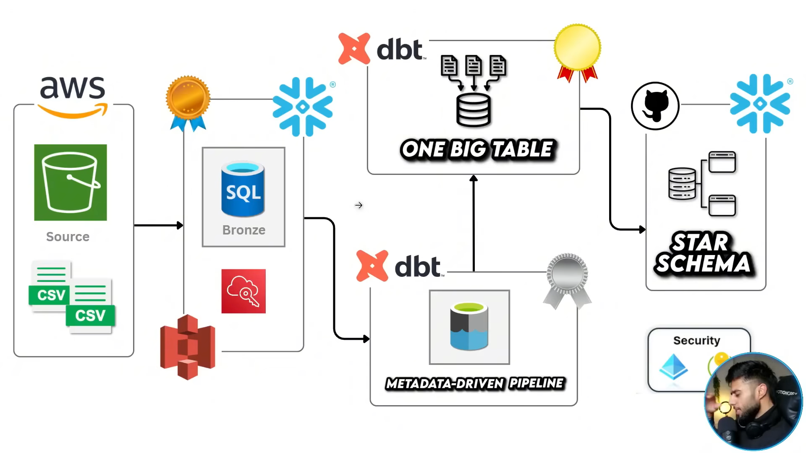

# AWS S3 → Snowflake → dbt Analytics Pipeline  
## Medallion Architecture using Airbnb Dataset

An end-to-end modern data stack implementation using AWS S3, Snowflake, and dbt to build a scalable ELT analytics pipeline based on Medallion Architecture (Bronze → Silver → Gold).

This project uses the Airbnb public dataset to simulate a production-grade analytics engineering workflow.

---

## 🏗 Architecture Overview

Medallion Architecture Layers:

Bronze → Raw Ingestion Layer  
Silver → Cleaned & Transformed Layer  
Gold → Analytics & Business Layer  

Data Flow:

AWS S3 (Airbnb CSV Source)  
        ↓  
Snowflake Raw Tables (Bronze)  
        ↓  
dbt Transformations (Silver)  
        ↓  
Gold Layer Models  
        ↓  
Star Schema / One Big Table for Analytics  

---

## 🛠 Tech Stack

- AWS S3 (Data Storage)
- Snowflake (Cloud Data Warehouse)
- dbt (Transformation Layer)
- Python
- Git & GitHub

---

## 📊 Features

- Layered data modeling (Bronze/Silver/Gold)
- Modular SQL transformations
- Reusable macros
- Data quality tests
- Clean Git-based workflow

---

## 🔄 ELT Workflow

### 1️⃣ Bronze Layer
- Raw Airbnb CSV data loaded into Snowflake
- Minimal transformation
- Source-aligned schema

### 2️⃣ Silver Layer
- Data cleaning
- Type casting
- Deduplication
- Standardization
- Business logic application

### 3️⃣ Gold Layer
- Star schema modeling
- Fact & dimension tables
- One Big Table for reporting
- Analytics-ready dataset

---

## 📊 Example Business Questions

- What are the top revenue-generating cities?
- Average listing price by neighborhood?
- Host performance metrics?
- Seasonal demand trends?
- Occupancy rate analysis?

---

## 🎯 Project Goal

To simulate a production-grade cloud data warehouse implementation using real-world Airbnb data and modern analytics engineering best practices.

## 🏗 Architecture Diagram

